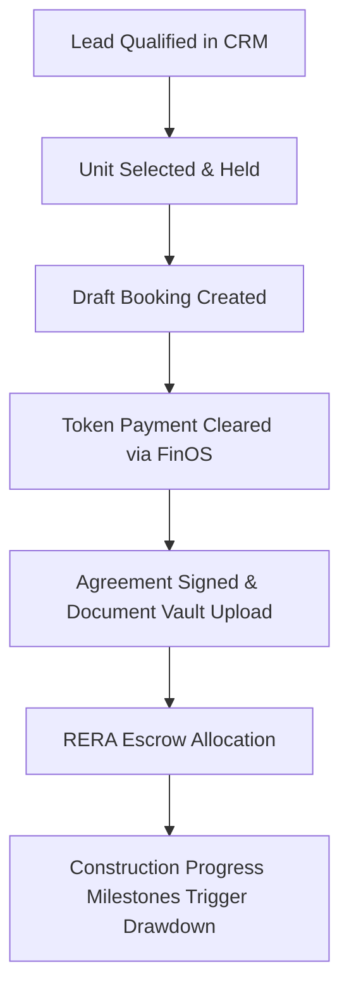

# Avenue Builders Operating System (ABOS): Deliverables Pack 1

## 1. Product Vision Document
The **Avenue Builders Operating System (ABOS)** is a unified, AI-native enterprise operating system created to serve as the single digital headquarters for real estate developers, construction companies, finance departments, sales organizations, and executive leadership.

### Primary Objectives
* **60-Second Executive Visibility**: Provide owners and C-level executives with full operational and financial visibility within 60 seconds.
* **Elimination of Fragmented Tools**: Replace scattered spreadsheets, WhatsApp coordination, paper approval chains, and isolated point CRMs/ERPs with one interconnected system of record.
* **Interconnected Operations**: Tying lead generation, unit booking, land title clearances, BOQ estimation, site progress (DPR), material inventory, bank escrow accounts, and AI anomaly alerts into a unified state engine.

---

## 2. Functional Requirements Specification (FRS)

### FRS-01: Sales & CRM Engine
* **FR-1.1**: Lead distribution engine supporting auto-round-robin assignment by lead score and project affinity.
* **FR-1.2**: Unit hold locking mechanism with automated 48-hour timeout unless payment is verified.
* **FR-1.3**: Customer interaction timeline aggregating calls, site visits, and WhatsApp updates.

### FRS-02: Construction & Site Operations
* **FR-2.1**: Gantt chart milestone tracking with dependency links across active towers and floors.
* **FR-2.2**: Daily Progress Report (DPR) submission interface supporting mobile photo uploads and site labour headcount logs.
* **FR-2.3**: Automated delay prediction comparing targeted vs. actual milestone dates.

### FRS-03: BOQ & Procurement
* **FR-3.1**: Quantity estimation matrix comparing baseline BOQ caps against live PO purchase rates.
* **FR-3.2**: Automated cost deviation flagging when actual material rates exceed BOQ thresholds by >2.5%.
* **FR-3.3**: RFQ supplier comparison engine with vendor quality rating scorecards.

### FRS-04: FinOS & Banking Treasury
* **FR-4.1**: Multi-bank account tracking with dedicated RERA Escrow account segregation.
* **FR-4.2**: Real-time cash position calculation subtracting pending vendor payables from verified customer receivables.
* **FR-4.3**: Double-entry general ledger voucher tracking with automated GST categorization.

---

## 3. Software Requirements Specification (SRS)

### System Context & Boundaries
* **Backend Framework**: NestJS (TypeScript) with Modular Monolith architecture.
* **Frontend Framework**: Next.js 14 (App Router) with Tailwind CSS and dark mode glassmorphism UI.
* **Database**: PostgreSQL managed via Prisma ORM.
* **Queue Engine**: BullMQ backed by Redis for asynchronous SLA timers and AI background jobs.

---

## 4. User Flows & Business Rules

### User Flow: Booking to Cash Disbursement

### Core Business Rules (BR)
* **BR-01**: No unit can be marked `confirmed` without a cleared payment reference in the ledger.
* **BR-02**: Any Purchase Order exceeding ₹ 5,00,000 requires CFO approval via the Workflow Engine.
* **BR-03**: Daily Progress Reports (DPR) must be submitted before 20:00 local time by assigned site engineers.
