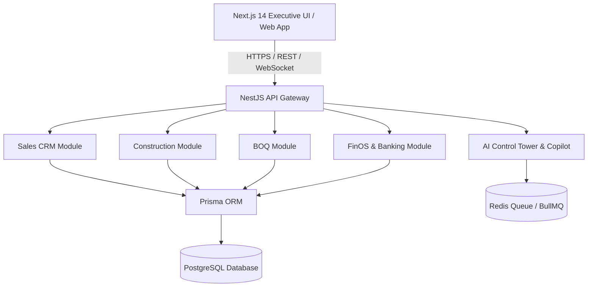

# Avenue Builders Operating System (ABOS): Deliverables Pack 2

## 5. Complete System Architecture & ERD

### High-Level System Architecture

---

## 6. Role & Permission Matrix (RBAC / ABAC)

| Role Persona | CRM & Bookings | Construction & DPR | BOQ & Procurement | FinOS & Banking | Legal & RERA | System Admin |
| :--- | :---: | :---: | :---: | :---: | :---: | :---: |
| **Owner / CEO** | Read / Write | Read / Write | Read / Approve | Read / Approve | Read / Approve | Full Control |
| **Sales Head** | Full Control | Read | Read | Read | Read | None |
| **Project Manager** | Read | Full Control | Read / Write | Read | Read | None |
| **Site Engineer** | None | Write (DPR) | Read | None | None | None |
| **Finance Head** | Read | Read | Read / Approve | Full Control | Read | None |
| **Legal Counsel** | Read | None | None | None | Full Control | None |

---

## 7. Core Module REST API Specification

### Endpoint Specifications
* `GET /api/v1/units`: Retrieve listing of project units with current status (`available`, `held`, `booked`).
* `POST /api/v1/bookings`: Create a new draft booking against a held unit.
* `GET /api/v1/construction/gantt`: Fetch project Gantt tasks and milestone progress.
* `POST /api/v1/construction/dpr`: Submit a Daily Progress Report with labour counts and weather logs.
* `GET /api/v1/boq/variance`: Fetch estimated vs. actual BOQ cost comparison grid.
* `GET /api/v1/finos/cash-position`: Calculate current total cash, RERA escrow balance, and pending payables.
* `POST /api/v1/ai/query`: Send natural language query to the AI Copilot reasoning engine.
